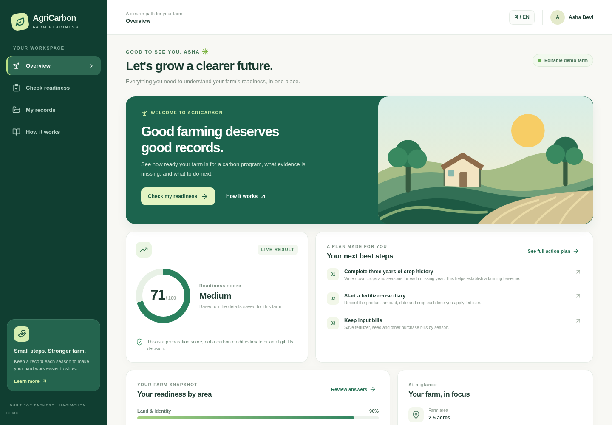
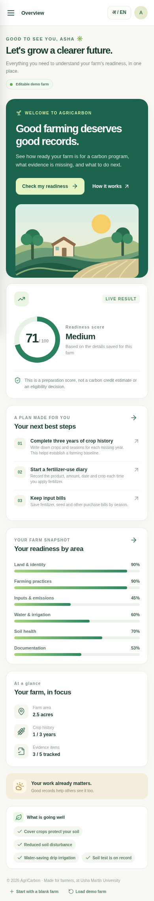

# AgriCarbon

AgriCarbon is a farmer-friendly **carbon-program readiness demo** built at Usha Martin University for a 24-hour hackathon. It helps a farmer answer three questions: **Am I ready? What is missing? What should I do next?**

The current project is a frontend prototype. It does **not** calculate, issue, sell, or guarantee carbon credits. A real program must evaluate eligibility, establish a baseline, measure outcomes, and independently verify results.

## Show the UI to mentors

The screenshots below show the working frontend. Open this README on GitHub to view them immediately. The repository link shows the code and screenshots; it is not a hosted interactive website.

**Desktop**



**Phone**



For an interactive demo on a laptop, follow **Run locally** below. In the app, click **Check my readiness**, change an answer, and show how the score and next steps update. Then open **My records** and use the **अ / EN** button to show Hindi.

## Run locally

Requires Node.js 20 or newer.

```bash
npm ci
npm run dev
```

Open `http://localhost:3000`. For a production check, run `npm run build` and `npm run start`.

## What judges can try

1. The home screen opens with an **editable example farm**. Its score shows how the six categories combine.
2. Choose **Check readiness** and change answers in the three-step form. The score updates immediately.
3. Choose **My records** to mark evidence available and see the personalized action plan.
4. Switch between **English and Hindi** with the language button.
5. Use **Start with a blank farm** at the bottom to see a new farmer journey, or **Load demo farm** to reset the example.

Answers are saved in the browser's `localStorage`, so the demo works without an account or backend. Clearing browser storage removes the saved answers. The records page is a checklist; no document files are uploaded, stored, or verified. Do not treat its ticks as independent evidence.

## Readiness model

The TypeScript rules are in [`lib/readiness.ts`](lib/readiness.ts). The weighted score is:

| Area                 | Weight |
| -------------------- | -----: |
| Land and identity    |    15% |
| Farming practices    |    30% |
| Inputs and emissions |    20% |
| Water and irrigation |    10% |
| Soil health          |    10% |
| Documentation        |    15% |

The bands are **High** (80–100), **Medium** (60–79), **Developing** (40–59), and **Getting started** (0–39). The score is a hackathon guidance tool, not a standard's approval formula. The app deliberately shows missing history, documents, and practices beside the number. A soil card is treated as preliminary information, not final soil-carbon verification.

## Project structure

- `app/page.tsx` — entry page
- `components/AgriCarbonApp.tsx` — screens, forms, local storage, and language copy
- `lib/readiness.ts` — data model, six-category scoring, and action-plan rules
- `app/globals.css` — responsive design

The UI uses Next.js, React, TypeScript, CSS, and Lucide icons. There are no API keys or backend services.

## Research starting points

- [Verra VM0042 Improved Agricultural Land Management](https://verra.org/methodologies/vm0042-improved-agricultural-land-management-v2-2/)
- [Verra VM0042 FAQ](https://verra.org/methodologies-main/frequently-asked-questions-vm0042/)
- [FAO: Carbon markets for smallholders](https://www.fao.org/4/i2485e/i2485e00.pdf)

These references inform the checklist and cautionary wording. Program requirements vary, and future versions should be reviewed with agronomists, local farmer groups, and the relevant carbon standard.
