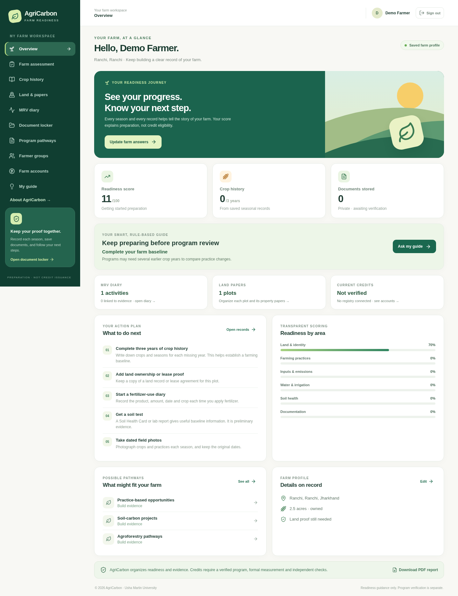
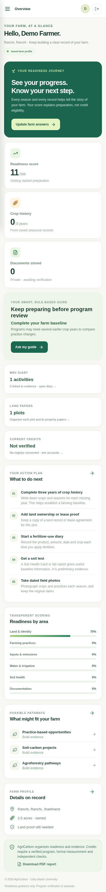
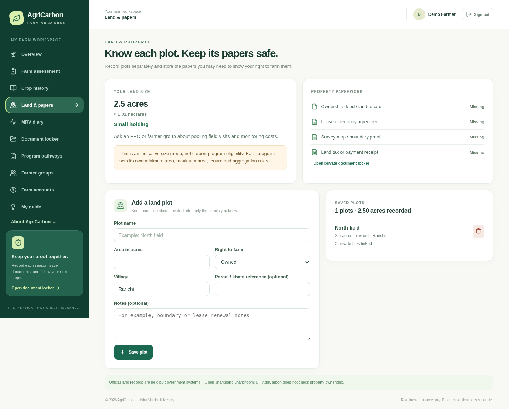
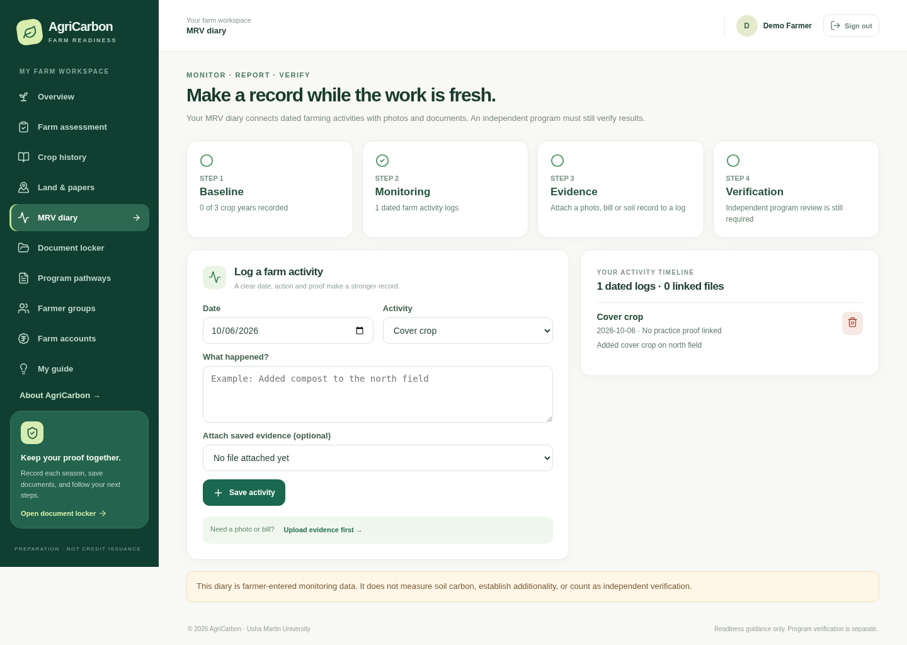
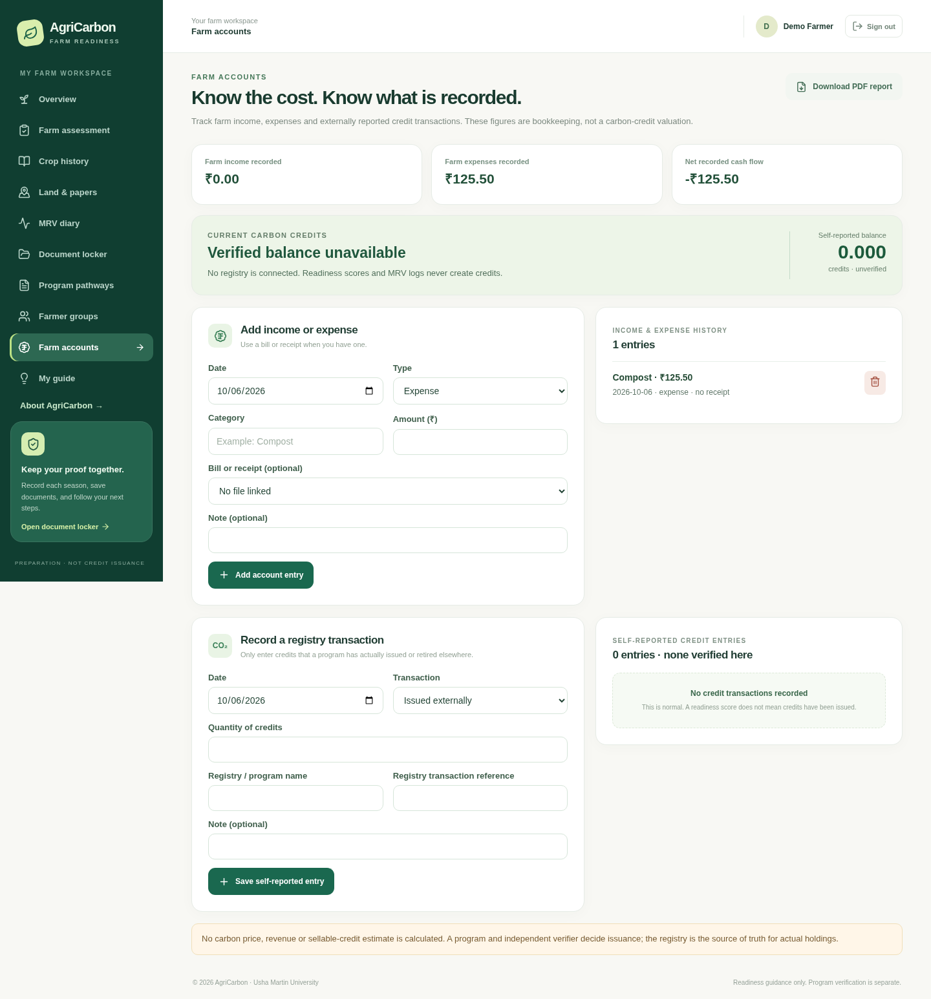
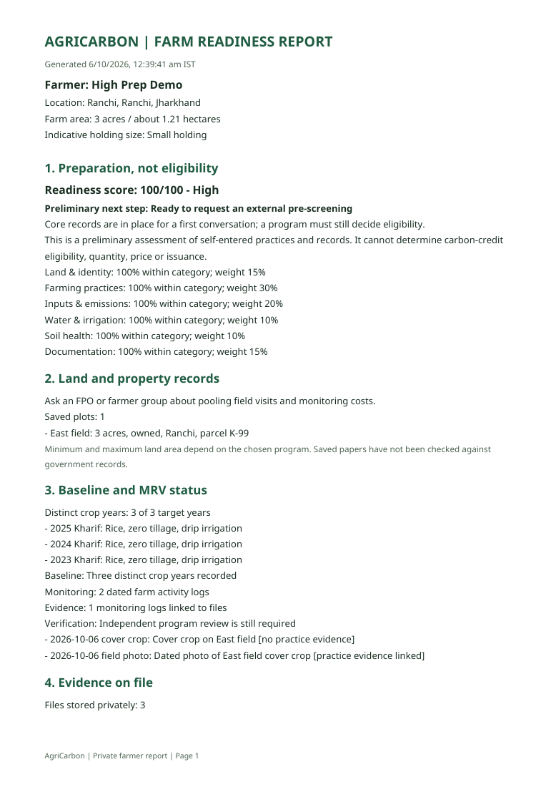
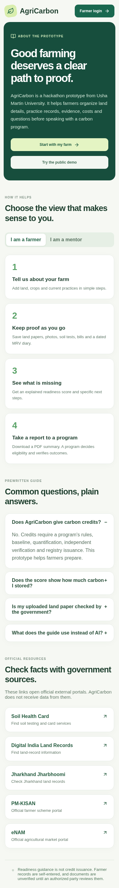

# AgriCarbon

AgriCarbon is a farmer-friendly **carbon-program readiness web app** built at Usha Martin University for a 24-hour hackathon. It helps a farmer answer three questions: **Am I ready? What is missing? What should I do next?** The interactive [About page](app/about/page.tsx) explains the prototype to farmers and mentors and links to official public resources.

The app has a public editable demo and a signed-in farmer workspace. It does **not** calculate, issue, sell, or guarantee carbon credits. A real program must evaluate eligibility, establish a baseline, measure outcomes, and independently verify results.

## Show the UI to mentors

The screenshots below show the working frontend. Open this README on GitHub to view them immediately. The repository link shows the code and screenshots; it is not a hosted interactive website.

**Desktop**


**Phone**


**Signed-in farmer workspace**





**New workflows (synthetic example data)**

| Land & papers                                                                           | MRV diary                                                               |
| --------------------------------------------------------------------------------------- | ----------------------------------------------------------------------- |
|  |  |

| Farm accounts                                                                                            | Generated PDF report                                                                   |
| -------------------------------------------------------------------------------------------------------- | -------------------------------------------------------------------------------------- |
|  |  |



For an interactive demo on a laptop, follow **Run locally** below. The public demo needs no account. For the saved farmer workflow, choose **Farmer login**, create an account, and add a crop season or document. The private workspace uses the same readiness rules as the demo.

## Run locally

Use Node.js **22 LTS** or 24. npm comes with Node.js. Clone this repository and open the `Agricarbon` folder in VS Code. In **Terminal → New Terminal**, run:

```bash
npm ci
npm run dev
```

Open `http://localhost:3000` on that computer. To stop the server, press **Ctrl+C**. For a production check, run `npm run build` and `npm run start`.

**Windows PowerShell:** If Windows says `npm.ps1 cannot be loaded because running scripts is disabled`, use `npm.cmd ci` and `npm.cmd run dev`. This does not require changing the execution policy. You can also select **Command Prompt** from VS Code's terminal menu and use the normal `npm` commands.

## What judges can try

1. Open `/` for an **editable example farm**. Change answers in **Check readiness** and see the six-category score update. This public demo has an English/Hindi switch.
2. Open **Farmer login** and register with a name, mobile number, password, location, land arrangement, and farm area. No SMS service is needed for this local prototype.
3. In the farmer workspace, save practice, input, water, and soil answers. Add crop seasons from different years; the recorded year count updates automatically.
4. Open **Land & papers** to list separate plots and see an indicative land-size band. Carbon programs set their own minimum and maximum land criteria. Save deeds, leases, boundary maps, tax receipts, soil reports, bills, or photos in **Document locker**. Files are private to that account and **unverified**.
5. Open **MRV diary** to add dated practice logs and link each to a saved evidence file. The four-step view distinguishes baseline, monitoring, evidence and independent verification.
6. Open **Farm accounts** to record INR income and costs. External credit transactions can be recorded with a registry reference as **self-reported** entries. There is **no verified credit balance** until a real registry is connected.
7. Ask **My guide** a prewritten question. Its answers and personalized suggestions come from visible rules and the farmer's saved records; it does not use an AI service.
8. Try **Program pathways** and **Farmer groups**. Only a group organizer sees aggregated member readiness; documents remain private.
9. Choose **Download PDF report** to get an actual generated PDF with score, land, MRV, documents, accounts, suggested next actions and a clear credit-status warning. The printable HTML view remains available at `/farmer/report`.

The public demo saves answers in browser `localStorage`. Signed-in accounts, plots, crop history, MRV diary, finance and credit entries, and file metadata use a local SQLite database; uploaded files are saved under the ignored `.agricarbon-data/` directory. Data stays on the computer running the app. Back up that directory if you need to keep farmer records. Set `AGRICARBON_DATA_DIR` before starting the server to choose another location. **Never commit this data directory to the public repository.** The local prototype does not encrypt the database or files at rest; use synthetic documents for public demos.

## Readiness model

The TypeScript rules are in [`lib/readiness.ts`](lib/readiness.ts). The weighted score is:

| Area                 | Weight |
| -------------------- | -----: |
| Land and identity    |    15% |
| Farming practices    |    30% |
| Inputs and emissions |    20% |
| Water and irrigation |    10% |
| Soil health          |    10% |
| Documentation        |    15% |

The bands are **High** (80–100), **Medium** (60–79), **Developing** (40–59), and **Getting started** (0–39). The score is a hackathon guidance tool, not a standard's approval formula. The app deliberately shows missing history, documents, and practices beside the number. A soil card is treated as preliminary information, not final soil-carbon verification.

## Project structure

- `app/page.tsx` and `components/AgriCarbonApp.tsx` — public editable demo
- `app/about/`, `app/login/`, and `app/farmer/` — About, account, farmer workspace and printable report
- `components/portal/` — farm, crop, land, MRV, accounting, document, guide, program and FPO screens
- `app/api/` — authenticated API routes
- `app/api/report/pdf/` — private, generated PDF report
- `lib/server/` — SQLite storage, password hashing, sessions, validation, and private files
- `lib/readiness.ts`, `lib/insights.ts`, and `lib/programs.ts` — transparent scoring, gap advice, holding-size guidance, MRV status and pathway rules

The app uses Next.js, React, TypeScript, CSS, Lucide icons, SQLite and pdf-lib. It needs no API keys. Passwords are salted and hashed; session cookies are HTTP-only, and authenticated requests enforce the same origin. Files are limited to PDF, JPEG, PNG, or WebP at 8 MB each. For a real public deployment, move the database and files to managed persistent services, enable HTTPS and backups, and add production identity verification, rate limiting and abuse protection. This local hackathon app has no SMS/OTP, official land-record connection, document verification, live carbon-program or registry feed, or credit issuance.

## Checks

```bash
npm run lint
npm run typecheck
npm run build
```

## Research starting points

- [Verra VM0042 Improved Agricultural Land Management](https://verra.org/methodologies/vm0042-improved-agricultural-land-management-v2-2/)
- [Verra VM0042 FAQ](https://verra.org/methodologies-main/frequently-asked-questions-vm0042/)
- [FAO: Carbon markets for smallholders](https://www.fao.org/4/i2485e/i2485e00.pdf)

These references inform the checklist and cautionary wording. Program requirements vary, and future versions should be reviewed with agronomists, local farmer groups, and the relevant carbon standard.
